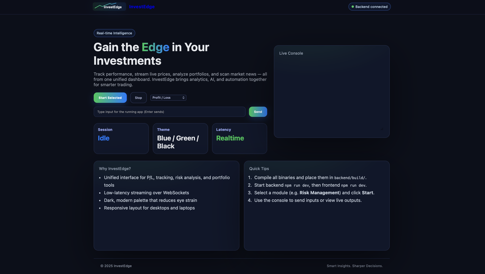
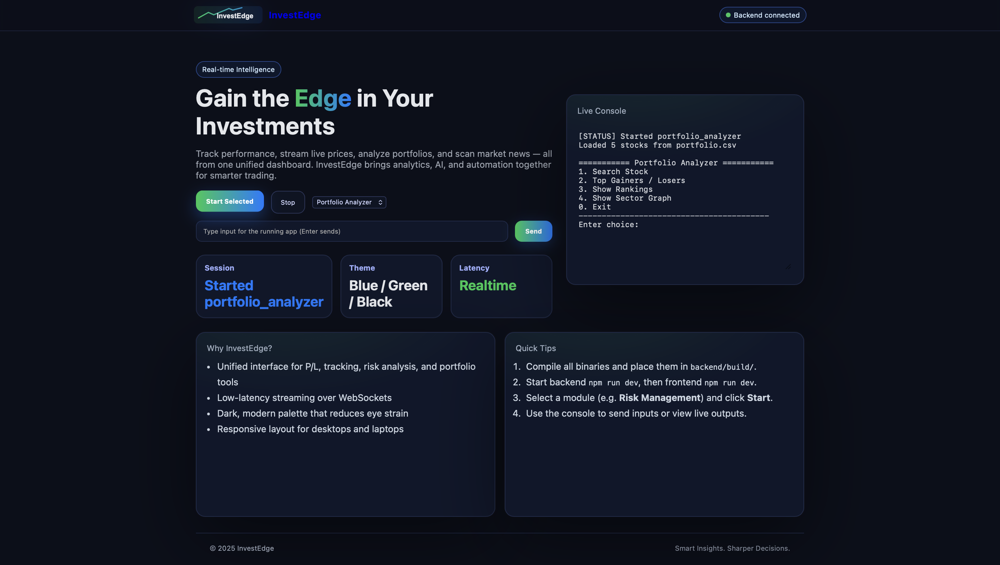
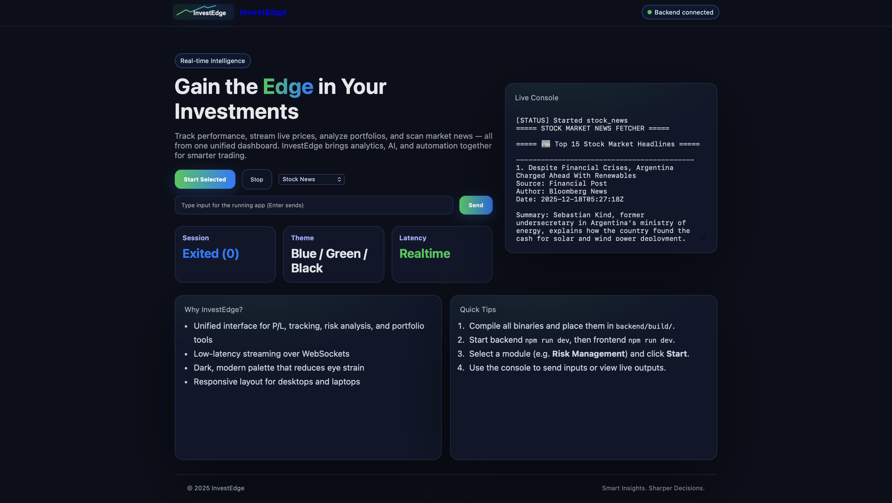
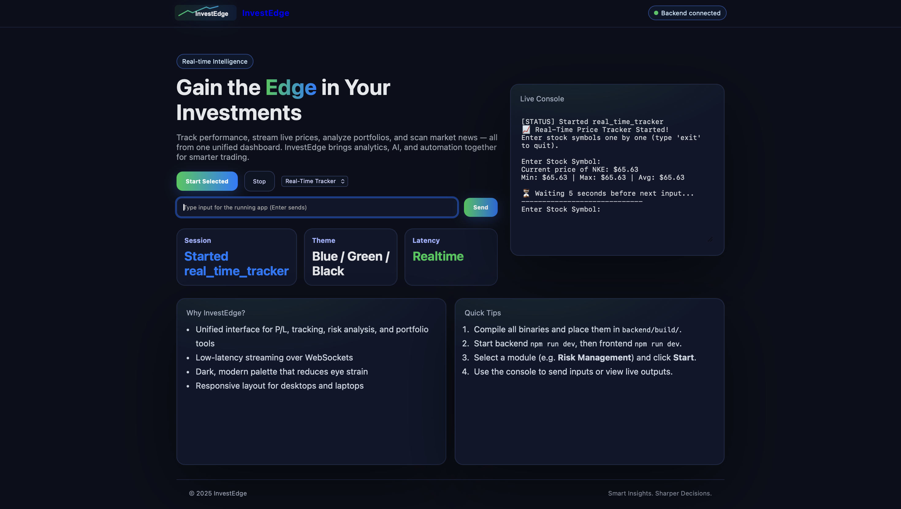

# InvestEdge 📈

**InvestEdge** is a full-stack investment analytics platform that integrates
high-performance **C++ financial computation engines** with a **Node.js backend**
and a **React (Vite) frontend** to deliver portfolio analysis, risk evaluation,
profit & loss tracking, and real-time market insights through a modern web dashboard.

---

## 🚀 Key Features

- 📊 **Portfolio Analysis**
  - Asset allocation
  - Portfolio-level metrics
  - CSV-based portfolio ingestion

- 💰 **Profit & Loss Engine (C++)**
  - Realized and unrealized P&L computation
  - High-performance numerical processing

- ⚠️ **Risk Management**
  - Volatility estimation
  - Exposure analysis
  - Risk indicators for decision support

- ⏱️ **Real-Time Tracking**
  - Live stock data processing
  - Continuous market updates

- 📰 **Stock News Aggregation**
  - Market-relevant news extraction
  - Stock-specific information feeds

- 🌐 **Interactive Web Dashboard**
  - Clean and responsive UI

---

## 🛠️ Technology Stack

### Backend
- **C++** – Core financial analytics engines
- **Node.js** – API layer and orchestration
- **JSON** – Inter-process communication
- **CSV** – Portfolio data handling

### Frontend
- **React.js**
- **Vite**
- **CSS** – Custom UI styling

---

## 📁 Project Structure

```text
InvestEdge/
├── backend/
│   ├── profit_loss.cpp              # Profit & Loss computation module
│   ├── real_time_tracker.cpp        # Real-time stock tracking logic
│   ├── portfolio_analyzer.cpp       # Portfolio analytics engine
│   ├── risk_management.cpp          # Risk metrics and analysis
│   ├── stock_news.cpp               # Stock news processing
│   ├── server.js                    # Node.js backend server
│   ├── package.json
│   ├── README.md
│   ├── portfolio.csv                # Sample portfolio data
│   └── mains/
│       ├── profit_loss_main.cpp
│       ├── real_time_tracker_main.cpp
│       ├── portfolio_analyzer_main.cpp
│       ├── risk_management_main.cpp
│       └── stock_news_main.cpp
│
├── frontend/
│   ├── index.html
│   ├── vite.config.js
│   ├── package.json
│   ├── README.md
│   └── src/
│       ├── App.jsx
│       ├── main-investedge.jsx
│       └── ui/
│           ├── investedge.css
│           └── logo.svg
│
├── screenshots/
│   ├── dashboard.png
│   ├── portfolio_analysis.png
│   ├── stock_news.png
│   └── real_time_tracking.png
│
├── LICENSE
└── README.md
```

---

## ⚙️ Installation & Setup

### Prerequisites
- Node.js (v16+ recommended)
- C++ compiler (GCC / Clang)
- npm

---

### 🔧 Backend Setup
- cd backend
- npm install
- npm run dev


### 🔧 Frontend Setup
- cd frontend
- npm install
- npm run dev
- example: http://localhost:5173


### 📊 Sample Data
- Sample portfolio data is provided in:
- backend/portfolio.csv
- You can replace this file with your own portfolio dataset to analyze different assets.

### 🎯 Use Cases
- Portfolio performance analysis
- Risk-aware investment decision making
- Full-stack fintech system design demonstration

### 🔮 Future Enhancements
- Database integration (PostgreSQL / MongoDB)
- Authentication and user accounts
- WebSocket-based live price streaming
- Advanced risk models (VaR, CVaR)
- Dockerized deployment
- Cloud hosting

### 📄 License
This project is licensed under the MIT License.

### 👤 Author
**Dhruv Sharma**  
AI & Data Science Enthusiast | Aspiring Engineer

## 📸 Project Screenshots

### Dashboard Overview
<p align="center">
  
</p>

### Portfolio Analysis
<p align="center">
  
</p>

### Stock News
<p align="center">
  
</p>

### Real-Time Stock Tracking
<p align="center">
  
</p>

